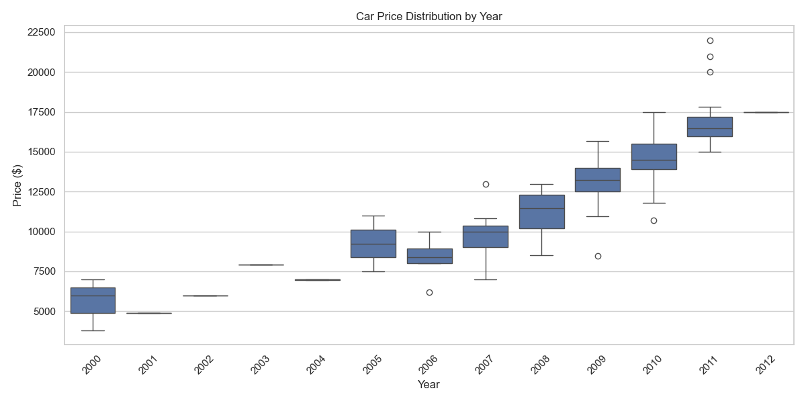
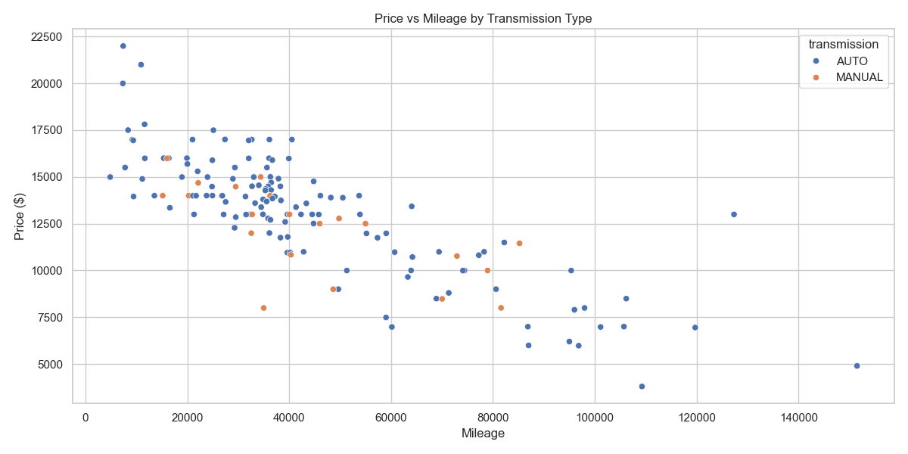
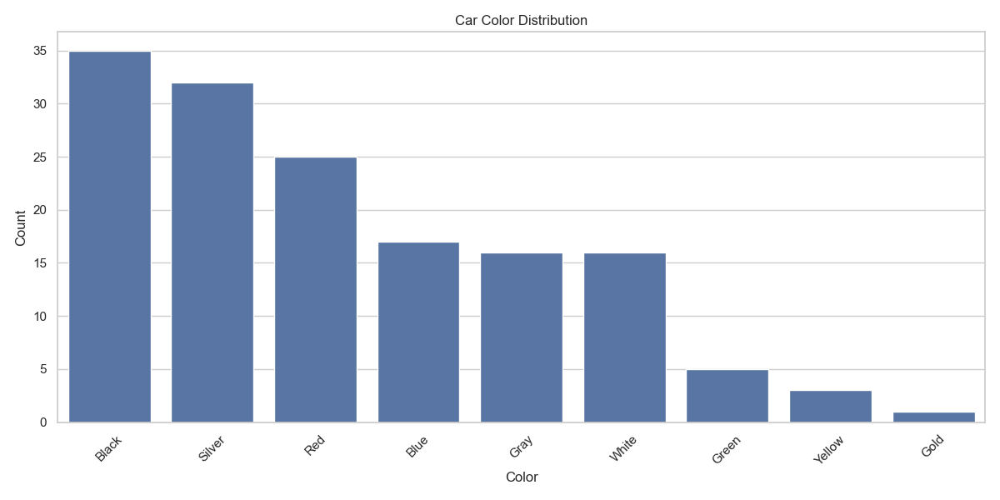
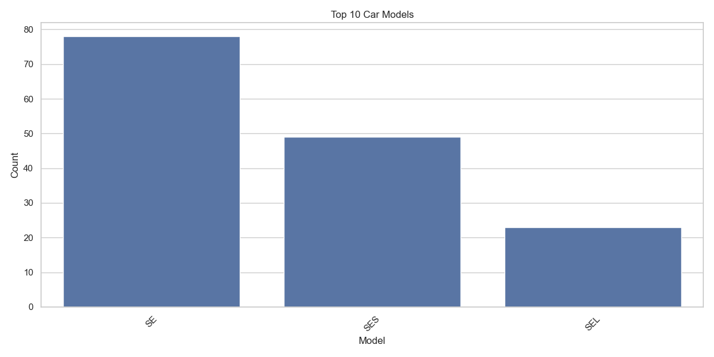

# 🚗 Car Data Analysis Project

[](https://www.python.org/)
[](https://dash.plotly.com/)
[](https://pandas.pydata.org/)
[](https://www.netlify.com/)

> 📊 An interactive dashboard analyzing used car data with visualizations for price trends, mileage relationships, color distributions, and model popularity.

## 📸 Dashboard Preview



## 🎯 Project Overview

This project provides comprehensive analysis of a used car dataset through:

- **✨ Interactive Dashboard**: Visually explore relationships in car data
- **📊 Four Key Visualizations**: Price trends, mileage impact, color preferences, and popular models
- **🔍 Detailed Metadata**: Complete dataset analysis including statistics and distributions
- **📱 Responsive Design**: Works on desktop and mobile devices

## 📂 Project Structure

```
📁 car_data_analysis/
├── 📄 car_dataset.csv         # Primary dataset of used cars
├── 📄 data_analysis.py        # Data processing and visualization script
├── 📄 dashboard.py            # Interactive Dash dashboard application
├── 📁 images/                 # Visualization images for documentation
├── 📁 outputs/                # Generated analysis files
│   ├── 📄 metadata.json       # Dataset statistics and metadata
│   ├── 📄 data_extract.csv    # Summary statistical extract
│   ├── 📄 data_sample.csv     # First 50 records sample
│   └── 📄 *.html, *.png       # Visualization outputs 
└── 📄 requirements.txt        # Python dependencies
```

## 📊 Visualizations

| Visualization | Description | Preview |
|---------------|-------------|--------|
| **Price Distribution by Year** | Shows how car prices vary by manufacturing year |  |
| **Price vs Mileage by Transmission** | Explores relationship between price and mileage for different transmission types |  |
| **Car Color Distribution** | Shows color preferences in the dataset |  |
| **Top 10 Car Models** | Displays the most common car models |  |

## 📋 Dataset Information

The dataset contains information about used cars including:

- **🗓️ Year**: Manufacturing year
- **🚙 Model**: Car model name
- **💰 Price**: Selling price in USD
- **📏 Mileage**: Mileage on the odometer
- **🎨 Color**: Car color
- **⚙️ Transmission**: Type of transmission (AUTO, MANUAL)

Source: GitHub (Machine Learning with R datasets)

## 🚀 Getting Started

### Prerequisites

- Python 3.10+
- pip package manager

### Installation

1. **Clone the repository**
   ```bash
   git clone https://github.com/SquizAI/DW_capstoneHW.git
   cd DW_capstoneHW
   ```

2. **Create and activate a virtual environment**
   ```bash
   python -m venv venv
   source venv/bin/activate  # On Windows: venv\Scripts\activate
   ```

3. **Install dependencies**
   ```bash
   pip install -r requirements.txt
   ```

### Running the Analysis

1. **Generate visualizations and extracts**
   ```bash
   python data_analysis.py
   ```

2. **Launch the dashboard**
   ```bash
   python dashboard.py
   ```
   Then open http://127.0.0.1:8050/ in your browser

## 🌐 Deployment

### Netlify Deployment

1. Create a `netlify.toml` file with the following content:
   ```toml
   [build]
     publish = "outputs/"
   ```

2. Connect your GitHub repository to Netlify
3. Configure the build settings as needed
4. Deploy! 🚀

## 📝 License

This project is licensed under the MIT License - see the LICENSE file for details.

## 🙏 Acknowledgements

- Data sourced from Machine Learning with R datasets
- Created for the Data Analysis Capstone Project, 2025

---

<div align="center">
  <p><strong>Created with ❤️ by <a href="https://github.com/SquizAI">SquizAI</a></strong></p>
  <p>© 2025 All Rights Reserved</p>
</div>
